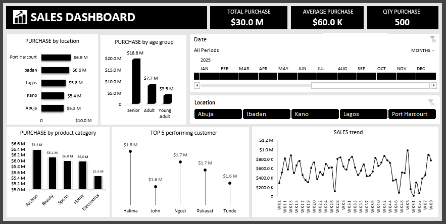

# 📊 Sales Performance Analytics Dashboard (Excel)

## 📌 Project Overview
This project demonstrates how I transformed raw sales data into actionable insights using **Excel dashboards**.  
The workflow covers **data cleaning → exploratory data analysis (EDA) → pivot tables → pivot charts → interactive dashboards**.

## 🎬 Dashboard Demo Video

Watch the full walkthrough of the Sales Performance Analytics Dashboard in Excel:

▶️ [sales_performance_dashboard_demo_video.mp4](sales_performance_dashboard_demo_video.mp4)

This demo showcases how raw sales data was transformed into actionable insights using Excel, including pivot tables, charts, slicers, and timelines.

## 📸 Dashboard Screenshot

The dashboard provides a high-level view of sales performance, featuring interactive filters, trend analysis, and customer segmentation insights.

## 🛠 Tools & Techniques
- **Excel**: Pivot Tables, Pivot Charts, Timelines, Slicers  
- **Data Cleaning**: Handling missing values, formatting, standardization  
- **EDA**: Customer segmentation, product category analysis, revenue trends  
- **Visualization**: Bar, column, and line charts with interactivity  

## 📊 Key Insights
- **Revenue:** $30M total | $60K average purchase | 500 total quantity → high-value, low-frequency sales  
- **Location:** Port Harcourt leads; Lagos ranks third despite being a commercial hub  
- **Customer Segments:** Seniors contribute **62% of revenue**; young adults contribute the least  
- **Products:** Fashion is the most purchased category, but demand is balanced across categories  
- **Customer Dependency:** Top 20% of customers contribute **20% of revenue**  
- **Weekly Trends:** Peaks in Weeks 13, 27, 31, 43, 50 | Dips in Weeks 19, 27, 47, 51, 53  

## 💡 Recommendations
- Engage **young adults** to diversify revenue sources  
- Boost sales in **underperforming locations** like Lagos  
- Promote **high-demand products** while maintaining balanced offerings  
- Expand customer base to reduce dependency on top performers  
- Investigate weekly peaks/dips for **inventory and marketing planning**  

## 📈 Dashboard Features
- Interactive **timeline** to track weekly sales trends  
- **Slicers** for quick filtering by location and product category  
- Dynamic pivot charts (bar, column, line) for visual storytelling  

## 🌟 Learning Outcomes
- Strengthened skills in **data cleaning, EDA, pivot tables, and interactive dashboards**  
- Gained experience in **storytelling with data** and making **business-driven recommendations**  
- Built confidence in creating dashboards that support **decision-making**  

👉 *This project highlights my ability to move from raw data to actionable insights using Excel. It’s a portfolio-ready example of how analytics can drive smarter business strategies.*  

## 👤 Author
Created by Abdulrasaq Ibrahim Ademola.
I am passionate about data analytics and visualization.
Connect with me on linkedin (https://www.linkedin.com/in/abdulrasaq-ibrahim-ademola/) and github.
